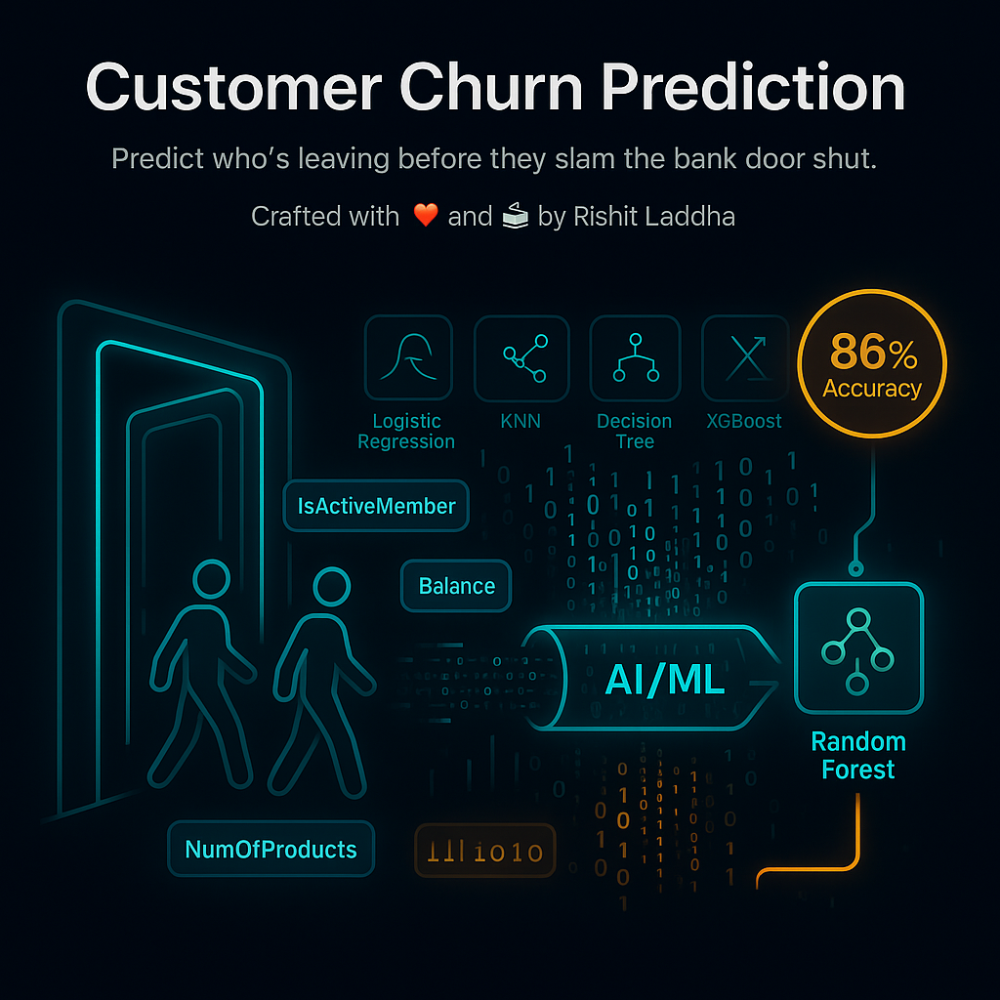

💳 Customer Churn --> Predict who’s leaving before they slam the bank door shut.

Welcome to **Customer Churn Prediction** — a machine learning project that stares into banking data and whispers:  
*"This customer’s about to ghost you."*  



It’s equal parts predictive modeling, feature engineering, and “huh, that makes sense” insight machine.

---

🎥 Demo & Links  
- 📊 Dataset: [Kaggle – Churn for Bank Customers](https://www.kaggle.com/datasets/mathchi/churn-for-bank-customers)  
- 📄 Research Paper: *Customer Churn Prediction Using Machine Learning Techniques*  
- 💻 Code Repo: You’re looking at it!  

---

🎯 Why this exists (and why it matters)  
- Banks bleed money when customers leave.  
- Acquiring new ones costs way more than keeping old ones.  
- ML can spot the “at-risk” crowd early → banks can act before churn happens.  

---

✨ Features at a glance  
- Tried-and-tested models: Logistic Regression, KNN, Decision Trees, Random Forest, XGBoost  
- Data cleaning & balancing: handled class imbalance with oversampling  
- Best performer: **Optimized Random Forest → 86% test accuracy**  
- Insights: Features like `IsActiveMember`, `Balance`, `NumOfProducts` say a lot about loyalty  

---

⚙️ Quick Start  

```bash
# Clone and enter
git clone https://github.com/RishitLaddha/Customer-Churn.git
cd Customer-Churn

# (Optional) create a venv
python3 -m venv venv && source venv/bin/activate

# Install dependencies
pip install -r requirements.txt

# Open the notebook
jupyter notebook notebooks/index.ipynb
````

---

🗂 Folder layout

```
Customer-Churn/
├─ Data/                # Kaggle CSVs
│   └─ churn.csv
├─ notebooks/           # Jupyter notebooks
│   └─ index.ipynb
├─ README.md
└─ .gitignore
```

---

🔧 Tech notes (short & sweet)

* Stack: Python + scikit-learn + Jupyter
* Validation: K-Fold & Stratified K-Fold cross-validation
* Metrics: Accuracy, Precision, Recall, F1-score
* Output: Confusion matrices, feature importance, performance tables

---

🙌 Credits
Crafted with ❤️ and ☕ by **Rishit Laddha**.
Dataset courtesy of [Kaggle](https://www.kaggle.com/datasets/mathchi/churn-for-bank-customers).


---

